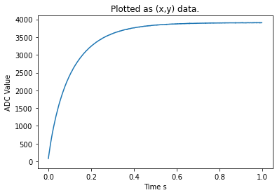
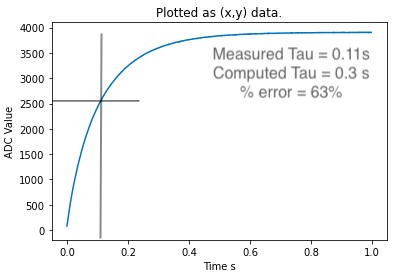

# ME 405 Lab 4

We Interupt This Program...

## If you have anything staged, commit now or stash forever

This lab required us to use an ADC pin object to measure voltage as ADC values from an RC Circut with a time constant of about .3 seconds. With the lab 4 code we were able to plot the ADC responce to get the actual time constant and its error. See images below.

__Figure 1:__ Raw RC Responce.

__Figure 2:__ Annotated RC Responce, (Tau Measured = .11s, %error = 63%).

The difference was outside of the 5%-25% range for error for typical electronic components. This may be due to a small resistance in our circut. 

### Classes

* [main.py](https://github.com/QuietJohn0/405Lab4/blob/main/src/main.py)

Classes used (not written by us)

* [task_share.py](https://github.com/QuietJohn0/405Lab4/blob/main/src/task_share.py)

Class run by the PC

* [Lab04_PC](https://github.com/QuietJohn0/405Lab4/blob/main/src/Lab04_PC.py)

## Documentation

* [Lab04 Documentation](https://github.com/QuietJohn0/405Lab4)

## Website Link

* [Lab04 Website](https://quietjohn0.github.io/405Lab4/index.html)
